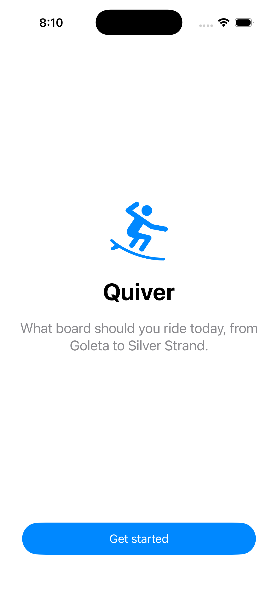

# Quiver

**Quiver** is an iOS app that tells you *which surfboard to ride today* — and, just as importantly,
keeps score on how good its own forecast is. It fuses free public marine data (Open-Meteo Marine +
Wind, NOAA NDBC buoys, NOAA Tides) into a spot-aware conditions picture, then recommends a board from
your quiver based on the surf, your skill, your body, and your wetsuit.

Built solo in SwiftUI + SwiftData (iOS 17+), local-first, no backend.

<p align="center"></p>

## Why it's interesting

- **A real multi-source forecast pipeline.** `CompositeConditionsProvider` fans out to four
  providers — Open-Meteo Marine (swell height/period/direction, SST), Open-Meteo Wind, NOAA NDBC
  realtime buoys, and NOAA Tides & Currents — and merges them into a single hourly
  `ConditionsSnapshot` array behind one `ConditionsProvider` protocol, with a 30-minute per-spot
  cache. Spots outside US buoy/tide coverage (e.g. Costa Rica) degrade gracefully to the global
  Open-Meteo feeds.
- **Forecast-accuracy backtest.** Surf forecasting is about *measurable* skill, so the app measures
  its own: it logs each Open-Meteo wave prediction, then — once that hour arrives — reconciles it
  against the live NDBC buoy reading and reports per-spot **mean absolute error and bias** (in feet).
  See `Backtest/`. The scoring math (`ForecastAccuracy.summarize`) is a pure function with unit tests.
- **A transparent, physics-gated recommendation engine.** A rule pipeline (`Recommender/`) gates on
  island swell-shadowing, tide state, wind, and local wave character, sizes board volume from body +
  skill + wetsuit, and clamps dimensions to physically sane bounds. An LLM layer (Gemini) refines the
  pick on top, always falling back to the rule engine offline — so the app is fully functional and
  deterministic with no key configured.
- **Dynamic wetsuit modeling.** Sea-surface temperature drives a wetsuit recommendation, and the
  added rubber's paddle-weight penalty feeds back into the volume calculation.

## Architecture

```
Quiver/
  QuiverApp.swift     App entry + SwiftData container
  Main/               Root nav, RecommendationView ("What to ride")
  Onboarding/         Profile questions + skill quiz
  Spots/              Spot list / picker + SpotsStore (decodes spots.json)
  Models/             SwiftData entities + value types + enums
  Resources/spots.json  Seeded spots (California Central Coast → Ventura, + Costa Rica)
  Conditions/         Open-Meteo + NDBC + NOAA Tides providers (ConditionsProvider protocol)
  Recommender/        The gated recommendation engine + Gemini layer
  Backtest/           Forecast-accuracy harness (record → reconcile → summarize)
  Forecast/           7-day forecast view
  Quiver/             Board CRUD + standalone dimension recommender
  Support/            Units / formatting
QuiverTests/          XCTest suite (67 tests; RecommenderTests is the engine spec)
```

Data flows one way: providers → `ConditionsSnapshot` → engine → `Recommendation` → UI. The backtest
taps the same snapshots (prediction + buoy actual ride along together), so verification needs no
extra network calls.

## Build & run

The project is XcodeGen-driven. The generated `Quiver.xcodeproj` is committed, so you can open it
directly — or regenerate it:

```sh
brew install xcodegen        # one-time
xcodegen generate
open Quiver.xcodeproj
```

Pick an iPhone 17 simulator (iOS 17+) and ⌘R. First launch walks onboarding (body metrics → skill
quiz) → spot picker → the recommendation screen. The gear opens your profile; the chart icon opens
the **Forecast Accuracy** dashboard.

### Tests

```sh
xcodebuild test -scheme Quiver -destination 'platform=iOS Simulator,name=iPhone 17'
```

One live-network test in `LiveConditionsTests` is skipped by default (flip `runLive = true`).

## Configuration & secrets

The Gemini refinement layer is **optional** — with no key, the app runs entirely on the deterministic
rule engine, so it builds and works out of the box.

**Easiest — in the app:** open the profile (gear icon) and paste your own key into the **Gemini AI**
field. It's stored in the device **Keychain** and takes effect immediately — no Xcode, no rebuild.
Grab a free key at [aistudio.google.com](https://aistudio.google.com).

**For development — via xcconfig** (never commit a key):

```sh
cp Secrets.example.xcconfig Secrets.xcconfig   # Secrets.xcconfig is git-ignored
# edit Secrets.xcconfig → set GEMINI_API_KEY = <your Google AI Studio key>
xcodegen generate                              # if you regenerate the project
```

`Config.xcconfig` (committed) defines an empty `GEMINI_API_KEY` and does an optional
`#include? "Secrets.xcconfig"`, so a fresh clone builds keyless while your local key is picked up when
present. The key is injected into `Info.plist` as a build setting and read at runtime by
`GeminiConfig` — it never touches source or git.

## Data sources

- [Open-Meteo Marine & Weather](https://open-meteo.com/) — swell, wind, sea-surface temperature (global)
- [NOAA NDBC](https://www.ndbc.noaa.gov/) — realtime buoy observations (forecast verification)
- [NOAA Tides & Currents](https://tidesandcurrents.noaa.gov/) — tide predictions (US)

## License

MIT — see [LICENSE](LICENSE).
